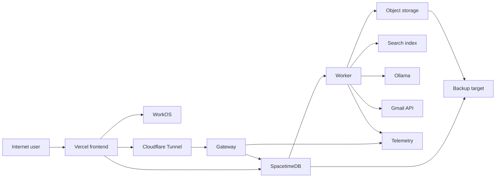

# Parrot repository threat model

Date: 2026-07-12

## Executive summary

Parrot is intended to expose a Vercel browser application and a Cloudflare-tunneled gateway while
keeping SpacetimeDB, workers, files, search, Ollama, and operational interfaces private on a shared
host. The highest risks are identity/bootstrap mistakes during public signup, shared-host lateral
movement, agent-tool or model abuse, capability leakage, and incomplete reconciliation of external
effects. The provider-neutral code already has strong deny-by-default authorization, bounded job and
tool execution, capability validation, and lifecycle fencing; release risk now concentrates in the
production adapters, secrets, host isolation, and deployment configuration.

## Scope and assumptions

- In scope: `services/gateway`, `services/worker`, `spacetimedb`, `packages/client-sdk`, generated
  public bindings, `infra`, and the browser/backend integration boundary.
- Runtime: public Vercel frontend at `parrot.skylarenns.com`; public HTTPS/WSS gateway at
  `parrotapi.skylarenns.com` through the existing Cloudflare Tunnel; private isolated services on
  `shhh.skylarenns.com`.
- Authentication: WorkOS AuthKit; public account creation is allowed, but workspace membership and
  the one-time initial owner bootstrap remain explicit authority operations.
- Initial scale: one test user; no regulated data, but private conversations, files, email addresses,
  agent prompts, credentials, and audit records remain sensitive.
- Operations: shared Ubuntu host, one-hour RPO, four-hour RTO, proposed retention schedule, backup
  target under `/mnt/bigboi`, and operator contact held outside this report.
- External mobile push is out of scope. Browser sound is advisory UI behavior after an authorized
  mention/reply notification and never an authorization or delivery guarantee.

Open questions that could change risk: whether public users may create their own workspaces, the
eventual multi-user scale, and whether backups will gain an encrypted off-host copy. This report
assumes self-service workspace creation is rate-limited but permitted and that `/mnt/bigboi` is a
separate local failure domain, not an offsite disaster-recovery copy.

## System model

### Primary components

- Vercel browser client consumes only generated caller-aware SpacetimeDB views and the hardened
  gateway SDK (`docs/project/frontend-integration-contract.md`).
- Fastify gateway authenticates external identity, resolves current principals, enforces browser
  boundaries, and issues short-lived database, file, search, and agent capabilities
  (`services/gateway/src/app.ts`, `services/gateway/src/auth/request-auth.ts`).
- SpacetimeDB is the authorization and collaboration authority; private tables are exposed through
  caller-aware views and reducer checks (`spacetimedb/src/authz.rs`, `spacetimedb/src/views.rs`).
- Worker processes claim durable outbox work and invoke search, file, email, model, export, and tool
  effects through reviewed adapter graphs (`services/worker/src/composition.ts`).
- Production providers are WorkOS, Gmail API, local immutable object storage, SQLite FTS5, host-local
  Ollama, and an isolated telemetry pipeline. Their adapters are release-critical code, not tests.

### Data flows and trust boundaries

- Internet browser -> Vercel: UI assets, WorkOS session material, user text/files; HTTPS, CSP and
  browser storage discipline required; the UI must not persist short-lived capabilities.
- Browser -> gateway: bearer/session credentials, commands, search, uploads and agent requests over
  HTTPS; exact origins, CSRF/mixed-credential rejection, schema and size validation, and rate limits.
- Browser -> SpacetimeDB: short-lived workspace-bound database ticket over WSS; caller-aware views,
  reducer authorization, command receipts, and authorization epochs.
- Gateway/worker -> SpacetimeDB: service identities and scoped grants over private networking;
  private tables, exact job leases, generation fencing, and bounded service views.
- Worker -> providers: files, notification bodies, search documents, prompts and tool requests over
  private IPC/HTTPS; provider-specific bounds, idempotency and reconciliation are mandatory.
- Cloudflare Tunnel -> gateway: public HTTP/WSS forwarded to one loopback origin; only the approved
  hostname/routes may match and administrative SpacetimeDB/worker endpoints remain private.
- Runtime -> backup/telemetry: database snapshots, object manifests and redacted operational events;
  strict permissions, integrity signatures, retention, and no message/file/token logging.

#### Diagram

## Assets and security objectives

| Asset | Why it matters | Security objective |
| --- | --- | --- |
| Workspace, DM, post and file content | Private collaboration data; disclosure or corruption harms users | C/I/A |
| Membership, roles, lifecycle and audit state | Defines authorization, deletion and accountability | I/A |
| WorkOS, Gmail, signing and service credentials | Enables identity, email and privileged service access | C/I |
| Database/file/agent capabilities | Bearer authority with short but meaningful lifetime | C/I |
| Agent prompts, approvals and tool results | Can drive external effects or leak context | C/I/A |
| Object versions, export metadata and backups | Recovery and deletion integrity | C/I/A |
| Deployment artifacts and adapter modules | Production trust root loaded dynamically at startup | I/A |
| Shared host, GPU and service capacity | Failure or compromise affects Parrot and unrelated services | C/I/A |

## Attacker model

### Capabilities

- Remote unauthenticated users can create accounts, send internet traffic, probe public routes and
  attempt signup, login, upload and resource-exhaustion abuse.
- Authenticated users can submit rich text, files, search terms, agent prompts and authorized
  mutations, and can attempt cross-workspace identifier substitution or replay.
- Uploaded content and model/tool output are untrusted even when supplied by an authenticated user.
- A compromised provider response, dependency, frontend asset or low-privilege shared-host service
  may attempt credential theft or lateral movement.

### Non-capabilities

- Attackers are not assumed to hold host root, Cloudflare, GitHub, Vercel or WorkOS administrative
  access initially. Those events are credential/host compromise scenarios, not ordinary web input.
- Search, object storage, Ollama and telemetry are not authorization authorities and receive no
  direct public administrative route.
- Initial users are not assumed to handle regulated data; this lowers compliance impact but not the
  confidentiality requirement for private content and credentials.

## Entry points and attack surfaces

| Surface | How reached | Trust boundary | Notes | Evidence |
| --- | --- | --- | --- | --- |
| Gateway routes | Cloudflare HTTPS | Internet -> gateway | Auth, invitations, sessions, files, search, agents, webhooks | `services/gateway/src/app.ts` |
| WorkOS tokens/session | Browser bearer or cookie | WorkOS/browser -> gateway | JWT profile and current-principal resolution must agree | `services/gateway/src/auth/oidc.ts`, `request-auth.ts` |
| SpacetimeDB reducers/views | WSS ticket | Browser/service -> authority | Private tables, caller-aware views, command idempotency | `spacetimedb/src/reducers.rs`, `views.rs` |
| File capability flow | Gateway then signed PUT/GET | Browser -> object service | Exact size/type/hash/single-write/version checks | `services/gateway/src/files/service.ts` |
| Worker outbox | Private service view | Authority -> worker | Lease, generation, effect ledger and dedicated export completion | `services/worker/src/outbox.ts` |
| Agent/model/tool boundary | Worker/provider/tool | Untrusted prompt -> privileged effect | Approval, budgets, frozen args, deny-default egress | `services/worker/src/agent.ts`, `agent-tool-boundary.ts` |
| Cloudflare ingress | Public hostname | Internet -> loopback | Shared tunnel rule ordering and catch-all correctness | `infra/nginx/backend.conf.template` |
| Deployment scripts | Operator CLI | Operator -> shared host | Apply/confirm guards and isolated paths | `infra/scripts/validate-config.sh`, `infra/README.md` |

## Top abuse paths

1. Attacker creates many public accounts -> repeatedly invokes first-owner or workspace creation ->
   gains unintended authority or exhausts database/provider capacity.
2. Attacker steals a WorkOS/session/capability token -> replays it at gateway/WSS -> reads private
   content before expiry or revocation reaches every connection.
3. Authenticated user substitutes workspace/resource IDs -> exploits a production adapter that
   trusts input instead of authoritative scope -> crosses tenant boundaries.
4. User uploads crafted content -> bypasses quarantine/scanning or parser limits -> compromises the
   worker, exposes files, or exhausts disk/CPU.
5. Malicious post/file content enters agent context -> induces an agent/tool call -> attempts secret
   access, internal-network requests, destructive effects or data exfiltration.
6. Worker/provider times out after an external effect -> naive retry duplicates email, object writes
   or tool effects -> corrupts state or causes unwanted actions.
7. Attacker floods signup, search, uploads or Ollama jobs -> consumes shared RAM/swap/GPU/disk ->
   degrades Parrot and unrelated services on the host.
8. Shared-host service or deployment dependency is compromised -> reaches permissive networks,
   volumes or secrets -> pivots into Parrot or unrelated applications.
9. Cloudflare ingress rule is inserted after an earlier wildcard/catch-all or points to the wrong
   port -> exposes the wrong service or silently bypasses expected gateway controls.
10. Backup/log/telemetry pipeline captures tokens or content -> longer-lived secondary copy leaks ->
    deletion and credential rotation fail to contain impact.

## Threat model table

| Threat ID | Threat source | Prerequisites | Threat action | Impact | Impacted assets | Existing controls | Gaps | Recommended mitigations | Detection ideas | Likelihood | Impact severity | Priority |
| --- | --- | --- | --- | --- | --- | --- | --- | --- | --- | --- | --- | --- |
| TM-001 | Remote signup abuse | Public account creation | Capture bootstrap, mass-create workspaces or exhaust quotas | Privilege escalation or DoS | Roles, capacity | Atomic platform bootstrap and authoritative membership (`spacetimedb/src/reducers.rs`) | Production WorkOS/bootstrap/rate adapters unproven | Disable bootstrap immediately after the named owner; rate-limit by IP, identity and workspace; add signup quotas and alerts | Bootstrap attempts, signup velocity, workspace-create denials | Medium | High | High |
| TM-002 | Token thief | Token or cookie theft | Replay identity or short-lived capabilities | Private-data access or actions | Content, credentials | Exact issuer/subject resolution, CSRF, mixed-auth rejection, short TTLs (`services/gateway/src/auth/request-auth.ts`) | WorkOS token profile/session revocation not yet proven end to end | Secure HttpOnly cookies or in-memory bearer tokens, exact issuer/audience/type, CSP, session revocation tests, key rotation | Token failures by issuer/session, impossible reuse, epoch disconnects | Medium | High | High |
| TM-003 | Authenticated user | Valid low-privilege account | Substitute tenant/resource IDs through a weak adapter | Cross-tenant disclosure or corruption | All workspace data | Rust deny-default auth and caller-aware views (`spacetimedb/src/authz.rs`) | Production adapter conformance pending | Derive scope from authority plans; never trust payload tenant IDs; run two-tenant provider and browser tests | Cross-workspace authorization rejects and provider scope mismatches | Low | High | High |
| TM-004 | Malicious uploader | Upload permission | Supply parser exploit, mismatch or storage bomb | Worker compromise or resource exhaustion | Files, host availability | Checksum/size/single-write capabilities and quarantine (`services/gateway/src/files/service.ts`) | Scanner/extractor and local object endpoint unimplemented | Stream with byte/time bounds, isolate scanner, pin MIME detection, no archive recursion, immutable versions, quota and cleanup tests | Quarantine age, scanner failure, upload/object mismatch, disk growth | Medium | High | High |
| TM-005 | Prompt/content attacker | Agent can read attacker-controlled content | Prompt-inject model and induce privileged tool/secret/network use | Exfiltration or destructive action | Secrets, content, external systems | Exact scopes/approvals/budgets and immutable central boundary (`services/worker/src/agent-tool-boundary.ts`) | Ollama broker and production secret/transport boundary pending | Keep Ollama private; context labels; approval for non-read effects; scoped secret references; OS egress deny; adversarial tool conformance | Approval spikes, denied egress, secret-reference anomalies, tool outcome unknown | Medium | High | High |
| TM-006 | Provider/network failure | External effect succeeds but response is lost | Replay non-idempotent work | Duplicate actions or inconsistent state | Notifications, files, exports, tools | Stable effect identity, leases and reconciliation (`services/worker/src/outbox.ts`) | Gmail and Ollama do not natively guarantee exact request replay semantics | Deterministic message IDs, provider lookup where possible, durable broker ledger, outcome-unknown operator path | Reconciliation rate, duplicate semantic keys, stale leases | Medium | Medium | Medium |
| TM-007 | Remote resource abuser | Public endpoints and shared host | Flood signup/search/upload/model operations | Multi-service outage | Host/GPU/disk availability | Bounded inputs, job age and rate-limit contracts | Concrete quotas/cgroups and capacity alerts not deployed | Per-boundary limits, queue caps, GPU concurrency one, container memory/CPU limits, disk reservations and admission control | Swap/GPU/queue age, 429 rate, disk/inodes, OOM/restarts | High | High | High |
| TM-008 | Compromised shared service | Another host workload is breached | Traverse shared network, mounts, Docker socket or secrets | Cross-application compromise | Host and all application assets | Proposed isolated Compose projects and loopback services (`infra/README.md`) | Host is crowded; isolation not yet deployed | Dedicated OS user, networks and volumes; no Docker socket; read-only/rootless containers; minimal secret mounts; consider new VPS at scale | Network-flow deviations, container exec/restart, file-permission drift | Low | High | High |
| TM-009 | Operator/config error | Shared Cloudflare tunnel | Misorder hostname rule or expose admin port | Wrong-origin exposure or outage | Gateway and private services | Review-only allowlist and private admin design (`docs/operations/production-plan.md`) | Live route not installed/tested | Back up config, insert before catch-all, validate and match rule, canary replica, expose gateway only | Tunnel config checksum, route smoke tests, unexpected Host headers | Medium | High | High |
| TM-010 | Insider/secondary-store compromise | Access to logs/backups | Recover content, tokens or stale deleted data | Confidentiality and deletion failure | Content, secrets, backups | Redaction contracts and signed restore evidence (`docs/operations/backup-restore-runbook.md`) | `/mnt/bigboi` is local and offsite copy absent | Encrypt backup with separate key, strict ACL, manifest checks, retention cleanup, off-host copy, restore drills | Backup age/signature, redaction canaries, restore audit, retention drift | Medium | High | High |
| TM-011 | Supply-chain attacker | Compromised dependency/image/repository | Ship malicious adapter or frontend artifact | Full runtime compromise | Build and runtime trust roots | Pinned toolchains/images and production graph checks (`services/worker/src/composition.ts`) | Final images, GitHub protections and provenance not deployed | Private release keys, protected branch, CI scans/SBOM, digest-pinned promotion, adapter review, no build-time secrets | Provenance verification, dependency alerts, image-digest drift | Low | High | High |

## Criticality calibration

- Critical: unauthenticated remote code execution in gateway/worker; reliable WorkOS auth bypass;
  cross-workspace access at scale.
- High: credential/capability theft enabling private access; shared-host breakout; destructive agent-tool
  execution; unrecoverable authority/object corruption.
- Medium: targeted duplicate notifications/effects; bounded single-user outage; partial metadata leak
  without content or credentials.
- Low: noisy rejected probes; disclosure of non-sensitive product metadata; transient degradation with
  automatic recovery and no cross-service impact.

Initial one-user scale reduces blast radius but does not lower threats that expose credentials,
shared-host services, or public infrastructure. Open signup and shared hosting raise abuse and
availability likelihood relative to an invite-only isolated deployment.

## Focus paths for security review

| Path | Why it matters | Related Threat IDs |
| --- | --- | --- |
| `services/gateway/src/auth/` | WorkOS JWT/session trust and current-principal binding | TM-001, TM-002 |
| `services/gateway/src/app.ts` | Public routes, browser boundary and production composition | TM-002, TM-004, TM-007 |
| `services/gateway/src/files/` | Signed upload/download and quarantine invariants | TM-004 |
| `services/gateway/src/agent-tools/` | SSRF, DNS, redirect and secret egress choke point | TM-005 |
| `services/worker/src/composition.ts` | Complete durable production graph enforcement | TM-003, TM-011 |
| `services/worker/src/outbox.ts` | Lease, retry and ambiguous-effect recovery | TM-006 |
| `services/worker/src/agent.ts` | Prompt/context budgets and tool lifecycle | TM-005, TM-007 |
| `services/worker/src/workspace-export.ts` | Sensitive bulk export and exact cleanup | TM-006, TM-010 |
| `spacetimedb/src/authz.rs` | Core tenant and lifecycle authorization | TM-001, TM-003 |
| `spacetimedb/src/reducers.rs` | Bootstrap, idempotency, jobs and irreversible mutations | TM-001, TM-003, TM-006 |
| `spacetimedb/src/views.rs` | Caller/service data exposure boundaries | TM-003 |
| `infra/compose.yaml` | Shared-host networks, mounts and resource isolation | TM-007, TM-008 |
| `infra/scripts/` | Privileged deployment, backup and restore operations | TM-009, TM-010, TM-011 |
| `apps/web` | Browser token handling, XSS/CSP and capability persistence | TM-002, TM-005 |

Quality check: public/runtime entry points and every provider/host boundary are represented; runtime
is separated from CI/operator tooling; the confirmed one-user, public-signup, non-regulated-data,
shared-host, WorkOS and recovery assumptions are reflected. Provider adapters, live Cloudflare
configuration, real backup behavior and browser integration must be re-reviewed after implementation.
