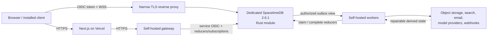

# ADR 0001: System architecture and authority boundaries

- **Status:** Proposed; blocked on the isolated SpacetimeDB 2.6.1 deployment preflight below
- **Date:** 2026-07-11
- **Scope:** Production topology, data authority, service boundaries, and deployment constraints

## Context

The product is a multi-tenant, real-time team communication system with first-class human, agent, and service identities. The frontend is Next.js/TypeScript on Vercel. Active collaboration state belongs in a Rust SpacetimeDB module. Model calls, email, file processing, malware scanning, webhooks, search indexing, and other nondeterministic or long-running work cannot run inside transactional reducers.

Three different SpacetimeDB versions are relevant and must not be conflated:

| Surface | Version | Decision impact |
| --- | --- | --- |
| Existing shared server host | 2.1.0 | Unrelated and immutable; this project will not publish to, upgrade, stop, or reconfigure it. |
| Existing global local CLI | 2.3.0 | Not used for production builds or binding generation. |
| Dedicated project host/toolchain | 2.6.1 (published 2026-07-01) | Exact pinned production target and source of current API behavior. |

The brief requires the latest stable SpacetimeDB 2.x. A separate 2.6.1 host will run in an isolated Compose project with its own localhost port, network, data volume, key material, resource limits, health checks, backup path, and rollback plan. The existing 2.1 service and its consumers remain untouched. CI and local development will use a project-pinned 2.6.1 toolchain rather than the older global CLI.

## Decision

Use a transactional core with explicit external-effect boundaries:

### Authority and data placement

SpacetimeDB is authoritative for active product state: tenants, identities, memberships, spaces, posts, messages, revisions, reactions, invitations, notification intent, file metadata, agent installations/runs, permission decisions, command receipts, outbox jobs, and audit records.

Secondary systems are deliberately non-authoritative:

- Object storage contains binary objects; SpacetimeDB contains their ownership, authorization, scan status, retention state, and object key. No object is served without a fresh authorization decision.
- Search contains a derived index. Every document carries tenant, resource, revision, and permission metadata. Query results are reauthorized before titles, snippets, counts, or previews are returned.
- Email, webhook, model-provider, and notification systems receive idempotent outbox work. Their delivery records are reconciled back to SpacetimeDB.
- Analytics and append-only audit mirrors may be rebuilt or replayed from authoritative state and the outbox. Deletion and permission changes propagate as first-class jobs.

### Rust module boundary

Reducers perform all authoritative mutations and enforce authorization within the same transaction. They are deterministic and side-effect free. A domain mutation and its audit/outbox rows commit atomically or all roll back. Expected validation failures return sender-safe errors; internal details remain in server logs.

All tenant-owned rows carry a globally unique resource ID and `workspace_id`. Central Rust authorization helpers implement deny-by-default checks; a reducer never trusts client-supplied actor, role, workspace, author type, or authorization flags.

Base tables holding tenant or identity data remain private. Reads are exposed through narrowly projected, indexed, caller-filtered Views. Public base tables are not used for sensitive data. If preflight exposes a View limitation, the fallback is authorized gateway reads—not experimental RLS and not public base tables.

SpacetimeDB procedures are not part of the core design. Current Rust procedure support is marked unstable, and procedures do not provide an automatic transaction around external I/O. External effects stay in the worker/gateway tier.

### Gateway and worker boundary

The gateway is the only component that may:

- broker browser sessions and short-lived database-audience tokens;
- authorize upload/download requests and issue short-lived object-store URLs;
- accept inbound webhooks and perform signature/replay validation;
- perform permission-filtered search queries;
- stream model output while persisting durable checkpoints;
- expose provider-neutral APIs to the frontend.

Workers execute outbox jobs, file scanning, indexing, email, model calls, webhooks, cleanup, and other long work. They authenticate with dedicated OIDC service identities. A service identity is necessary but insufficient: reducers also verify the registered service, enabled state, workspace scope, operation scope, run/job lease, and authorization epoch.

Gateway, workers, and SpacetimeDB run as separate processes/containers and operating-system principals with least-privilege network and secret access. Provider credentials live in an external secret manager; SpacetimeDB stores only secret references and non-secret configuration.

### External-effect protocol

1. A reducer validates the caller and commits the domain change, audit entry, and unique outbox job.
2. A worker observes an authorized outbox View and claims the job through a reducer with an owner, lease expiry, generation, and attempt number.
3. The worker performs the external operation using the stable `effect_key` as a provider idempotency key where supported.
4. A completion reducer accepts the result only from the current lease generation and records a sanitized outcome, retry schedule, or dead-letter state.
5. Uncertain outcomes are reconciled with the provider before retry; they are never blindly repeated.

This removes dual writes. Retried reducers cannot send email, call a model, or trigger a webhook because reducers only persist intent.

### Public ingress

The SpacetimeDB host is behind HTTPS/WSS termination. The reverse proxy exposes only the exact identity/token and subscription endpoints needed by the tested SDK flow. Anonymous database access is rejected at connection initialization and again by authorization checks. Publishing, SQL, logs, deletion, administrative, and unrestricted database routes are blocked from public networks.

Production administration is limited to a private network or localhost with separate credentials. Rate limits, connection quotas, request-size limits, timeouts, and structured security logging apply at the proxy and gateway.

### Operational requirements

- Backups include module data, object metadata, encrypted secret-manager state, and restore instructions. Restore tests must prove tenant isolation and referential consistency.
- Schema/module deployment is rehearsed against a disposable database, includes binding regeneration, and has a rollback or forward-repair plan.
- Every derived system has a full rebuild path and a cursor/checkpoint reconciliation job.
- SLOs cover connection success, reducer latency/error rate, subscription lag, outbox age, failed leases, search lag, agent run duration, and restore readiness.
- Logs are structured, tenant-aware, redact tokens/content by default, and carry request/job/run correlation IDs.

## Deployment preflight

No application module is exposed publicly until a disposable, exact-version 2.6.1 environment proves:

1. the pinned Rust module crate/toolchain and generated TypeScript bindings are reproducible and accepted by host 2.6.1;
2. OIDC issuer/audience validation and authenticated client connection behavior;
3. caller-aware Views, indexed filtering, column projection, and row removal after membership revocation;
4. subscription snapshot/update semantics and reconnect behavior with the selected TypeScript client;
5. any proposed optional feature, including confirmed reads or event tables.

CI will pin the proven module dependency, server image digest, and binding-generation path. APIs introduced after 2.6.1 are prohibited until a deliberate upgrade rehearsal proves them.

## Alternatives rejected

- **External calls in reducers:** reducers can replay and must remain deterministic; this would duplicate or lose effects.
- **SpacetimeDB procedures for all integrations:** current Rust procedures are unstable and weaken the clean transactional/outbox boundary.
- **Public base tables with client filtering:** leaks data through subscriptions, SQL, bugs, or future clients.
- **Experimental RLS:** official guidance says to use Views; the feature is experimental and unstable.
- **Search or object storage as an authorization authority:** secondary stores lag and can expose deleted or newly private data.
- **Upgrade the shared host during implementation:** explicitly outside current authority and a risk to other users of that host.

## Risks and required proof

- A preflighted 2.6.1 View or client limitation may block direct client reads and activate the gateway-read fallback.
- Direct WSS connections make immediate token revocation harder; ADR 0002 adds short token lifetimes, application epochs, reducer enforcement, and View-based data removal.
- A worker may crash after an external effect but before completion. Provider idempotency and reconciliation are mandatory.
- Search and file services may lag permission/deletion changes. Results and downloads require live authorization, and lag is observable.
- A compromised service identity could have broad reach. Each service has narrow scopes, network boundaries, short credentials, per-job leases, and auditable reducers.

Architecture tests must cover tenant isolation, denied public/anonymous routes, reducer replay, duplicate outbox delivery, worker crash/reclaim, secondary-store rebuild, deletion propagation, backup restore, and the full exact-version deployment preflight.

## Current official evidence

Accessed 2026-07-11:

- [SpacetimeDB v2.6.1 release](https://github.com/clockworklabs/SpacetimeDB/releases/tag/v2.6.1)
- [Reducers](https://spacetimedb.com/docs/functions/reducers/)
- [Reducer context](https://spacetimedb.com/docs/functions/reducers/reducer-context/)
- [Reducer error handling](https://spacetimedb.com/docs/functions/reducers/error-handling/)
- [Procedures](https://spacetimedb.com/docs/functions/procedures)
- [Views](https://spacetimedb.com/docs/functions/views)
- [RLS: official recommendation to use Views](https://spacetimedb.com/docs/how-to/rls)
- [Self-hosting and reverse-proxy guidance](https://spacetimedb.com/docs/how-to/deploy/self-hosting)
- [Authentication](https://spacetimedb.com/docs/core-concepts/authentication/)
