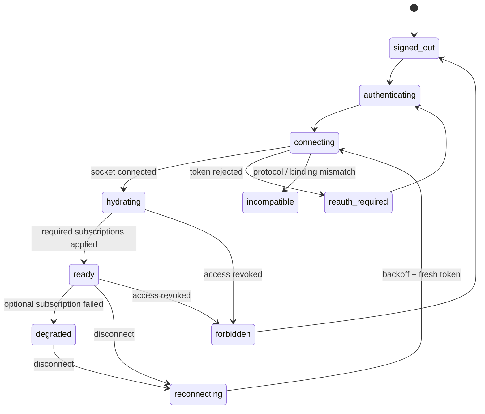

# ADR 0003: Real-time synchronization and reliability protocol

- **Status:** Proposed; transport details require the exact SpacetimeDB 2.6.1 deployment preflight
- **Date:** 2026-07-11
- **Scope:** Client connection state, subscriptions, ordering, optimistic UI, deduplication, replay, recovery, and external-work reliability

## Context

The product must remain understandable under slow networks, offline periods, browser refreshes, duplicate submissions, server restarts, concurrent edits, provider timeouts, and index lag. SpacetimeDB subscriptions provide atomic snapshots and committed transaction updates, but application correctness cannot depend on callback ordering, automatic reconnect, or ephemeral events.

## Decision

### Explicit client connection state

Every client implements and exposes this state machine:

`ready` means the current OIDC/app authorization epoch is valid and all required subscriptions have fired `onApplied`. The UI does not send authoritative writes while connecting, hydrating, reconnecting, revoked, or incompatible. Draft composition remains local, but stale command queues are not blindly flushed.

Reconnect uses bounded exponential backoff with jitter, an online signal only as a hint, and a fresh short-lived token. A new connection object replaces the old one. The client establishes required subscriptions in layers—principal/session, workspace, then selected space/thread—waits for each required snapshot, reconciles pending command receipts, and only then returns to `ready`.

Sign-out, revocation, and tenant switch immediately clear private replicated state, optimistic projections, cached search results, download URLs, and agent streams. Persisted drafts must be tenant/resource keyed and encrypted or content-minimized according to product policy.

### Subscription design and recovery

- Use precise typed queries/Views, grouped by common lifetime; never production-wide `subscribeToAllTables`.
- Subscribe to the new scope and await `onApplied` before removing the old scope when navigation requires continuity, while preventing overlap from double-rendering.
- Treat a subscription snapshot as recovery state. Persistent rows, not a missed-event log, reconstruct the UI after disconnect.
- Treat each transaction update atomically. Do not rely on relative callback invocation order; render from the post-transaction local cache.
- A required subscription error moves the client out of `ready`; an optional failure produces `degraded` with a visible retry path.
- Bound every subscription by workspace/resource/index and pagination/window policy to prevent accidental data or memory amplification.

Event tables may be used only for disposable hints such as typing or transient presence after host compatibility is proven. They are never the sole record for messages, notifications, edits, deletion, delivery, agent progress, approvals, or other state a reconnect must recover.

### Commands, idempotency, and optimistic UI

Every user-visible mutation carries a client-generated `client_request_id` (UUIDv7/ULID-quality) stable across retries. A `command_receipt` has a unique key derived from principal, operation, and request ID and stores canonical result identity/status. A reducer:

1. authenticates and authorizes against current resource state;
2. returns the existing receipt/result if the command already committed;
3. validates any expected revision;
4. commits the mutation, receipt, audit row, and any outbox intent atomically.

Optimistic state is a local projection tagged with the request ID. The server controls canonical IDs, timestamps, author, workspace, revision, and ordering fields. On rejection, the projection rolls back with an actionable error. On timeout/disconnect, status becomes `unknown`, not `failed`; after rehydration the client looks up the receipt or canonical row before offering retry.

Reducer calls that the current SDK may queue before connection are not treated as a durability mechanism. The application gates calls on `ready` and records pending UI intent independently.

### Ordering and concurrent change

The server assigns timestamps and stable IDs. Feeds sort by `(activity_at DESC, post_id DESC)`; thread messages sort by `(created_at ASC, message_id ASC)`. Clients never use receipt time or local clock as canonical order.

Editable resources carry a monotonic `revision`. An edit/delete reducer accepts `expected_revision`; a mismatch returns the current revision and conflict metadata rather than silently overwriting. Append-only interactions can merge by stable IDs. Visible edit/deletion state is persistent and included in subscription recovery.

Pagination cursors contain the complete stable sort tuple and scope. New activity may change a feed's first page, so clients reconcile overlapping boundaries by stable ID and never assume page position is identity.

### Durable confirmation

Current TypeScript docs expose `withConfirmedReads`, which delays query results until durable confirmation. It is desirable for workflows where the host's durability/replication semantics justify the latency, but it is conditional on exact-version measurement. The UI must not claim a stronger durability guarantee than the deployed host, backup policy, and confirmed-read behavior actually provide.

A committed reducer callback means the command was accepted by the authoritative database. User-facing language distinguishes accepted, externally delivered, and durably protected states where those differences matter.

### Worker/outbox reliability

External work uses the transactional outbox defined in ADR 0001. Jobs have unique IDs/effect keys, explicit states, attempt count, lease owner/expiry/generation, next-attempt time, sanitized last error, and dead-letter reason. Claim and completion reducers reject stale lease generations.

Retries use bounded exponential backoff with jitter and a maximum attempt/age policy. Provider timeouts create an `outcome_unknown` state and reconciliation step. A provider side effect without native idempotency uses a prepare/approve/execute protocol and is never automatically repeated after an ambiguous response.

Workers checkpoint long operations and respond to cancellation/revocation. Scheduled cleanup reclaims expired leases. Operators can inspect and safely replay dead letters through an audited reducer with a new generation, not by editing tables.

### Presence and notifications

Presence is soft state with a heartbeat expiry and must never gate access or imply guaranteed delivery. Notification intent and read state are persistent and deduplicated by event/recipient/channel. Push/email delivery is derived outbox work; provider duplicates do not create duplicate product notifications.

## Failure behavior

| Failure | Required behavior |
| --- | --- |
| Client loses WSS | Mark stale/offline, preserve drafts, stop writes, reconnect with jitter and a fresh token. |
| Reducer result is lost | Rehydrate and query receipt/canonical state before retry. |
| Subscription fails | Required: leave `ready`; optional: visible degraded mode. |
| Membership revoked | View removes data, epoch invalidates writes, cache clears, socket disconnects. |
| Server restarts | Reconnect and recover from persistent subscription snapshots. |
| Duplicate command | Return existing canonical result without another mutation/effect. |
| Concurrent edit | Reject stale revision and present conflict/current state. |
| Worker crashes | Lease expires; next worker reconciles uncertain effect before retry. |
| Search lags | Show freshness state; reauthorize all returned metadata; canonical navigation reads SpacetimeDB. |
| Provider times out | Record unknown outcome; reconcile or require human action. |

## Assumptions and compatibility limits

- Current docs state that automatic SDK reconnection is inconsistent across clients; the application protocol remains mandatory even if the selected React provider currently retries.
- Current subscription ordering/snapshot semantics are treated as the target contract, but are tested against the dedicated 2.6.1 host and exact generated client.
- Confirmed reads, event tables, typed query-builder details, and React hook queuing are optional until proven on the pinned 2.6.1 deployment.
- Recovery assumes persistent tables/Views correctly project all durable product state; ephemeral events add no correctness requirement.

## Alternatives rejected

- **Treat socket connected as ready:** required subscription snapshots and authorization may still be absent.
- **Blind offline command queue:** permissions, revisions, and targets can change while disconnected.
- **Retry on timeout without receipts:** can duplicate messages, notifications, billing, or external effects.
- **Order by client timestamps or callback sequence:** clocks drift and callback order is not guaranteed.
- **Use event tables as a durable event log:** disconnected clients can miss ephemeral broadcasts.
- **Subscribe to all tables:** expands data exposure, memory use, and lifecycle ambiguity.

## Required verification

Automated tests must inject slow/offline transitions, token expiry, browser refresh, duplicate submissions, lost responses, server restart, overlapping subscription changes, required/optional subscription errors, membership revocation during hydration, stale edit revisions, pagination boundary churn, reducer replay, worker crash at every claim/effect/complete boundary, provider timeout, dead-letter replay, index lag, and object deletion lag.

Property tests should prove stable sort/deduplication and receipt uniqueness. End-to-end tests must assert that no acknowledged message silently disappears and no unknown operation is automatically duplicated.

## Current official evidence

Accessed 2026-07-11:

- [TypeScript client and React connection behavior](https://spacetimedb.com/docs/clients/typescript/)
- [Client connection and reconnection guidance](https://spacetimedb.com/docs/clients/connection/)
- [Subscription semantics and ordering](https://spacetimedb.com/docs/clients/subscriptions/semantics/)
- [Subscription construction and lifecycle](https://spacetimedb.com/docs/clients/subscriptions/)
- [Event tables and their ephemeral behavior](https://spacetimedb.com/docs/tables/event-tables/)
- [Reducer transaction/replay model](https://spacetimedb.com/docs/functions/reducers/)
