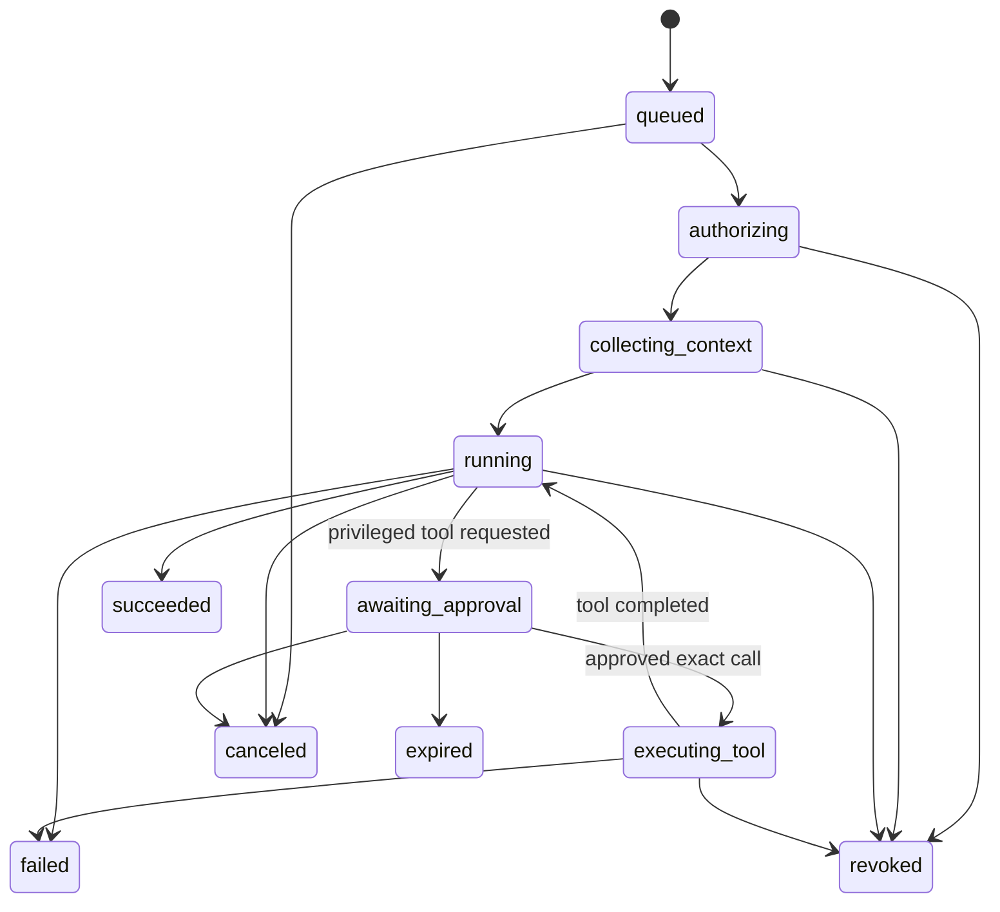

# ADR 0004: Agent runtime, permissions, and safety

- **Status:** Proposed; provider and MCP/tool inventory remain product/deployment choices
- **Date:** 2026-07-11
- **Scope:** First-class agent identities, run lifecycle, context authorization, tools, approvals, streaming, cancellation, audit, and prompt-injection defenses

## Context

Agents must be visible nonhuman participants, not privileged aliases for users. They need install/remove lifecycle, per-space access, bounded context, progressive status, cancellation/retry/inspection, auditable tool calls, provider neutrality, budgets, and safe integration with external systems. Workspace content, uploaded files, search results, linked pages, and tool output are all potential prompt-injection carriers.

## Decision

### Identity and installation

An `agent_definition` describes provider-neutral capabilities and declared tool needs. An `agent_installation` belongs to one workspace, has a visible name/avatar/nonhuman label, enabled state, installing administrator, policy version, budget/rate limits, and authorization epoch. `agent_scope` rows grant explicit actions and spaces/resources; omission denies access. Provider credentials are external secret-manager references, never database/client values.

Only authorized owners/admins can install, change scopes, rotate secrets, or remove an agent. Scope changes and removal increment the installation epoch and trigger cancellation of active runs. Agent-authored content always names the installation and run; it cannot visually or semantically impersonate a human, another agent, a service, an administrator, or the system.

The browser never invokes an agent-authored reducer by passing `author_type=agent`. It requests a run as the human sender. A registered worker service may later commit agent output only while presenting a valid run lease; the reducer derives and verifies the agent identity from the run and installation.

### Authoritative records

SpacetimeDB stores:

- `agent_installation` and `agent_scope`;
- `agent_run` with initiator, workspace/space, state, version, authorization epoch, attempt, lease, model/provider metadata, budgets, timestamps, and terminal outcome;
- `agent_context_manifest` with authorized object IDs, revisions, source types, hashes, redactions, policy decision, and retrieval time;
- `agent_run_event` for durable, coarse progress/status/checkpoints;
- `agent_tool_call` with tool/version, validated argument hash, scope decision, approval link, timing, idempotency/effect state, and sanitized result/provenance;
- `approval_request` bound to exact run/tool/arguments/effect class, one-time nonce, approver, expiry, and decision;
- command receipts, audit entries, and external-effect outbox jobs.

Tokens, full provider prompts/responses, secrets, and unrestricted tool output are not placed in client-subscribable rows. Retention and administrator inspection are explicit, least-privilege product policies.

### Run lifecycle

Terminal states are immutable. Every transition is a reducer that checks the expected run version, current installation/membership/scope epochs, initiating user's current authority where relevant, budget, and worker lease generation. Invalid or stale transitions fail atomically.

A worker claims a queued run using an expiring lease and generation, heartbeats it, and checkpoints at bounded intervals. A cancellation reducer sets `cancel_requested`, increments the run version, and records who canceled. The worker uses cooperative abort, stops streaming/tool work, and cannot commit later output because final reducers reject stale versions/epochs/leases.

Retry creates a new attempt linked to the prior attempt and uses new leases while retaining stable external effect keys where safe. It does not silently rerun an ambiguous destructive action.

### Context authorization and provenance

Context is assembled for this run, not copied from whatever the initiating user can broadly browse:

1. Determine the intersection of the initiating user's current access, agent installation scopes, requested task scope, workspace/space policy, data sensitivity, and explicit history authorization.
2. Fetch only the smallest necessary rows through authorized Views/gateway queries with field projection and bounded count/bytes/time.
3. Reauthorize each resource immediately before use and record ID, revision, source, trust class, redactions, and content hash in the context manifest.
4. Search accepts caller/run identity and returns only authorization-filtered source IDs; snippets/counts are not trusted until live reauthorization.
5. Tool results and linked content go through the same provenance and authorization path before becoming context.

The manifest makes a run inspectable without claiming that retaining all raw prompts is safe. If a permission changes mid-run, the epoch changes, further reads/tools/final commits fail, and the run becomes `revoked` or `canceled`.

### Prompt-injection and data-exfiltration controls

Workspace content, files, web pages, search results, emails, and tool results are labeled untrusted data. Instructions contained in them never change system policy, tool permissions, approval requirements, identity, scope, budget, or egress rules.

Defense is layered:

- immutable system/developer policy is separated from retrieved content with typed source boundaries;
- context sources have provenance and trust labels; quoted/retrieved text is delimited as data;
- tools are deny-by-default, allowlisted per installation/run, and expose narrow typed schemas rather than general shell/browser/network access;
- arguments are schema validated, normalized, scope checked, and bound to the current resource IDs;
- destructive, externally visible, credential-bearing, permission-changing, purchase/spend, or bulk actions require explicit human approval;
- an approval binds the exact tool version, normalized arguments hash, effect class, run, expiry, and one-time nonce; any change invalidates it;
- secrets are injected only at the worker/tool boundary, never into prompts, retrievable context, model-visible environment, or returned tool output;
- egress uses destination allowlists, DNS/IP rebinding protection, response-size/time limits, and blocked private/metadata networks;
- file parsers and active content run in a sandbox with malware/type checks and no ambient credentials;
- output is treated as untrusted and encoded/sanitized before rendering; generated links/actions do not auto-execute;
- context, output, token, request, rate, and dollar budgets are enforced server-side with hard stops;
- suspicious instruction/data flows are logged with redaction and tested using direct and indirect injection corpora.

Model-based injection classifiers may provide a signal but never replace deterministic authorization and tool controls.

### Tools, MCP, and external effects

The runtime is provider agnostic: provider adapters implement generation/stream/cancel/usage interfaces, while run state and policy remain in SpacetimeDB.

MCP servers and other tools are configured per installation with a minimal method/resource allowlist. The agent receives no general-purpose MCP credential. The gateway terminates MCP/tool access, maps the request to the run/service identity, validates current scope and approval, applies budgets/egress rules, and records the call.

Read tools reauthorize at call time. Mutating tools use a stable `effect_key` and provider idempotency when available. For non-idempotent effects, the runtime separates preparation from exact human approval and execution. If execution times out, the call becomes `outcome_unknown`; reconciliation or a new human decision is required before retry.

### Streaming and durable output

The gateway may stream provider tokens to currently authorized clients, but token streams are not the source of truth. It persists bounded progress events and paragraph/semantic checkpoints through reducers, avoiding a database row per token. On reconnect, clients recover run state/checkpoints from Views and resume display from the last durable sequence.

Final agent content commits through a reducer only after a fresh authorization/epoch/lease check. It is labeled as agent-authored and links to run provenance. If authorization was revoked, the final commit is rejected even if the provider completed.

### Revocation races

The worker rechecks authorization before every context fetch, tool call, external effect, and final write and watches run/installation epochs. Revocation requests cooperative cancellation and makes later reducer commits impossible.

An external side effect may race with revocation and cannot always be undone. The system therefore minimizes this window with last-moment checks, exact approval, effect idempotency, and auditable outcome reconciliation. The UI must say “effect may have occurred” when evidence is ambiguous; it must not falsely report cancellation as rollback.

## Assumptions and unresolved choices

- Initial model provider(s), agent catalog, MCP servers, retention limits, and cost ceilings require product/operator decisions.
- Provider cancellation is best effort; authoritative cancellation is enforced by refusing future tool/final commits.
- Progressive live streaming may use gateway transport distinct from SpacetimeDB. Durable checkpoints and final state remain recoverable through subscriptions.
- Current View/subscription APIs are conditional on the exact 2.6.1 deployment preflight in ADR 0001.

## Alternatives rejected

- **Agents act with the initiating user's bearer token:** obscures responsibility, survives scope mistakes, and prevents independent revocation/audit.
- **Put all workspace history in every prompt:** violates least context and amplifies disclosure/injection/cost.
- **Let prompt text decide tools or approval:** untrusted content could escalate itself.
- **Expose generic shell/browser/MCP access:** ambient capabilities defeat scoped authorization.
- **Store secrets in SpacetimeDB rows or prompts:** subscriptions, logs, inspection, or model output could disclose them.
- **Stream-only run state:** reconnects would lose progress, approval, and audit history.
- **Blind retry after provider timeout:** can repeat destructive or externally visible effects.

## Required verification

Tests must cover installation/removal/scope changes, cross-workspace references, human/agent/service impersonation attempts, smallest-context selection, unauthorized search snippets/counts, permission revocation during each lifecycle phase, cancellation/provider timeout races, stale lease and stale run-version commits, approval expiry/replay/argument mutation, idempotent and non-idempotent tool failures, budget/rate/provider limits, secret redaction, output sanitization, webhook replay, egress SSRF/DNS rebinding, malicious files, direct/indirect prompt injection, tool-output injection, and reconnect recovery of durable progress.

Security review must include a red-team corpus where workspace messages and documents instruct the model to reveal secrets, broaden scope, call unapproved tools, alter recipients/arguments, or impersonate privileged identities. Success means deterministic policy prevents the action regardless of model behavior.

## Current official evidence

Accessed 2026-07-11:

- [Reducers are transactional and may be re-executed](https://spacetimedb.com/docs/functions/reducers/)
- [Reducer context and authenticated sender identity](https://spacetimedb.com/docs/functions/reducers/reducer-context/)
- [OIDC authentication for users and services](https://spacetimedb.com/docs/core-concepts/authentication/)
- [Caller-aware Views](https://spacetimedb.com/docs/functions/views)
- [Subscription recovery semantics](https://spacetimedb.com/docs/clients/subscriptions/semantics/)
- [Procedures and current unstable Rust status](https://spacetimedb.com/docs/functions/procedures)
